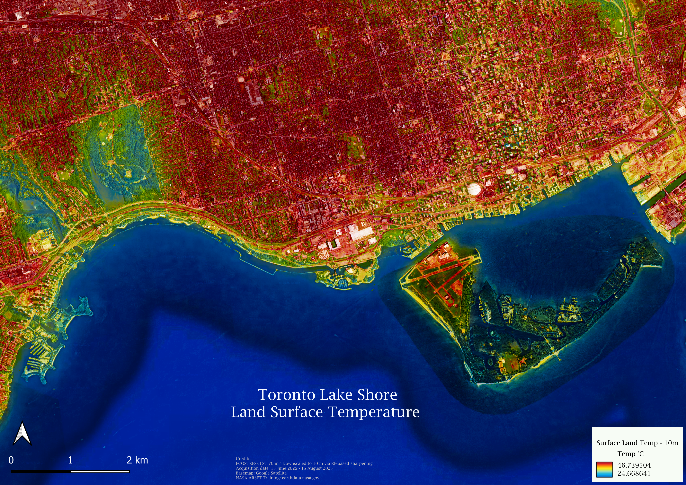
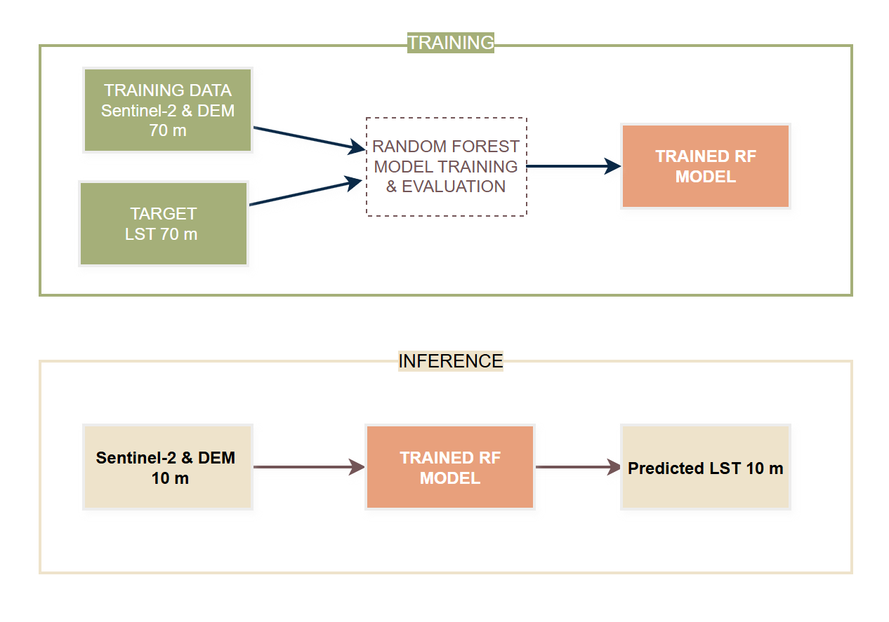
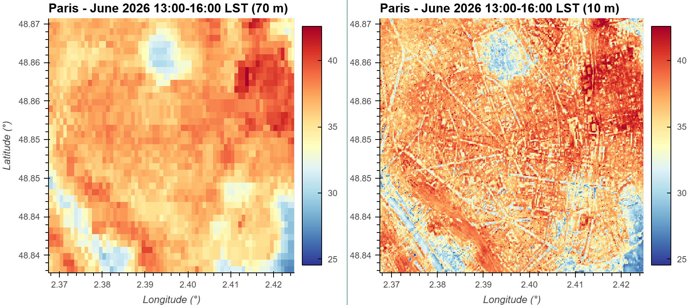

# ECOSTRESS LST Sharpening

A Python-only workflow that downscales NASA ECOSTRESS land surface
temperature (LST) data from 70 m to 10 m resolution using a Random
Forest model. Sentinel-2 spectral bands and Copernicus DEM terrain
variables serve as predictors, with residual correction applied to
tie the sharpened output back to the original ECOSTRESS values. The
pipeline has been tested across seven cities — Paris, Tunis,
Kitchener-Waterloo, Toronto, Cairo, Madrid, and Vancouver — to check
that it generalizes across different urban forms and climates.

This project is based on this [NASA ARSET training module](https://www.earthdata.nasa.gov/learn/trainings/introduction-thermal-remote-sensing-applications-urban-heat-island-mapping)

For the complete project write-up, see: [Full write-up](https://aychatammour.com/writing/ecostress_downscaling/lst_downscaling.html)

## Methodology

1. **Preprocessing** — ECOSTRESS LST tiles are pulled via `earthaccess`,
   masked for quality using bit-level QC decoding, water-masked, and cloud masked. 
   Where a scene spans multiple MGRS tiles, mosaics
   are built with feathered blending and bias correction.
2. **Predictors** — Sentinel-2 surface reflectance bands and Copernicus
   DEM are resampled to match the target 10 m grid.
3. **Model** — A Random Forest Regressor (`n_estimators=100`,
   `max_depth=15`, `min_samples_leaf=5`) is trained to predict LST from
   the predictor stack.
4. **Residual correction** — Model output is reconciled with the coarse
   ECOSTRESS observations, correcting
   systematic bias introduced by the resolution gap.
5. **Evaluation** — Feature importance (MDI and permutation-based) and
   diurnal temperature range (DTR) analysis are used to sanity-check
   what the model is learning and how it performs across sites.

## Workflow Overview

The diagram below summarizes a simplified end-to-end downscaling pipeline, from ECOSTRESS data preprocessing and predictor preparation to model inference and heatmap outputs.

## Paris Example (June 2026)

The figure below shows an example of LST sharpening for Paris during June 2026, illustrating the enhanced 10 m thermal detail produced by the workflow.

